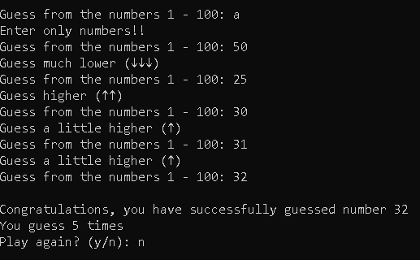
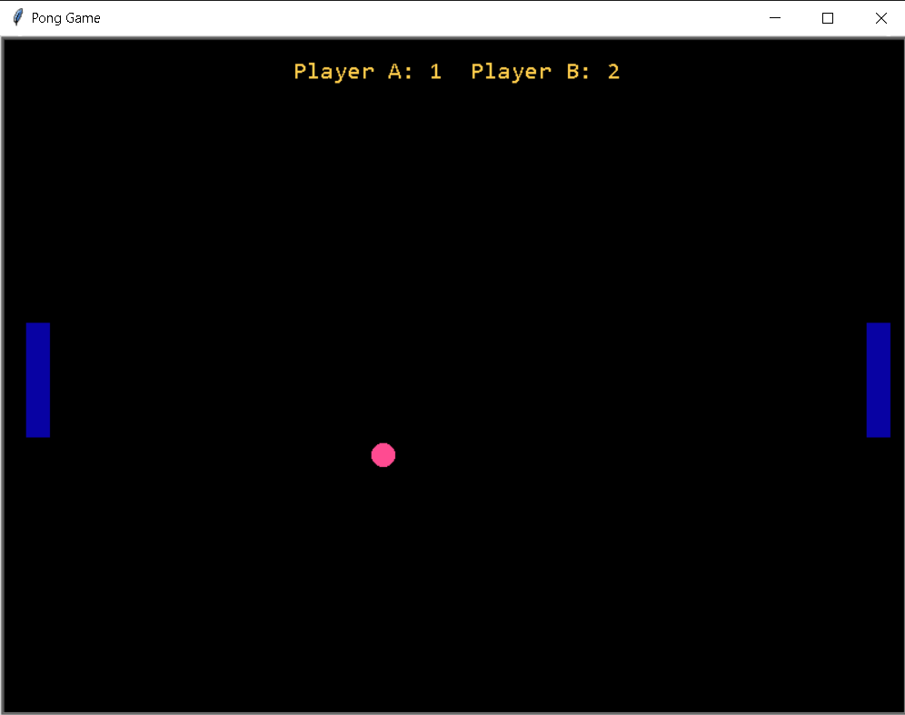
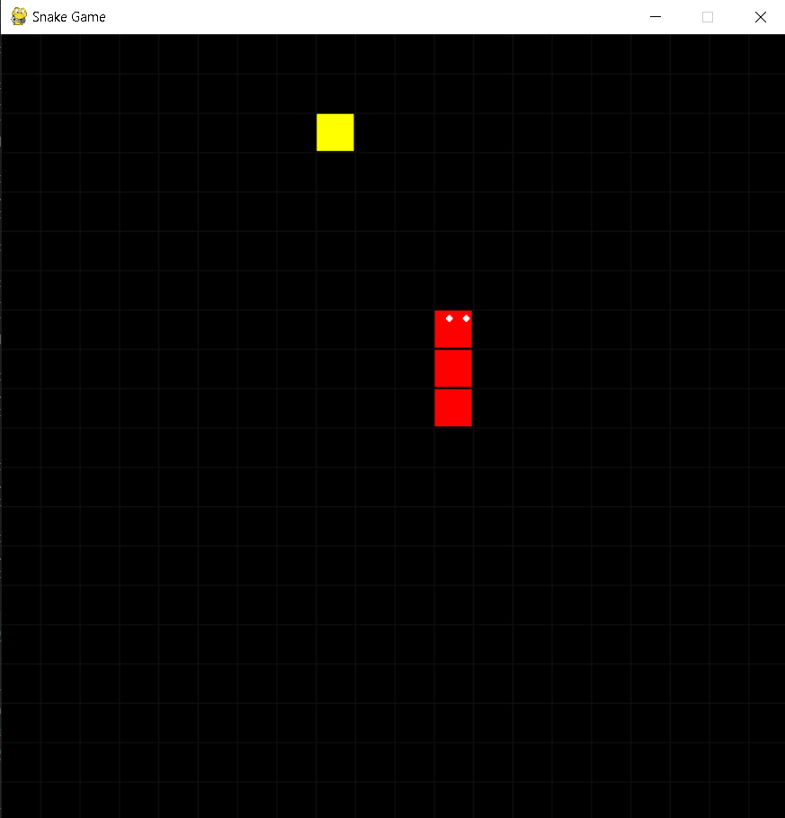
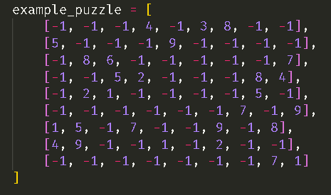
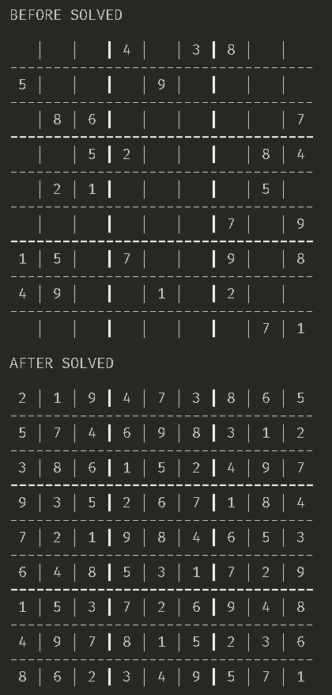
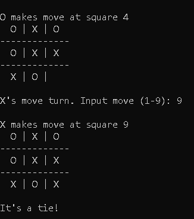

# Python Mini Project

Several mini / simple projects created using the Python language.

## The Projects

### Guess Number

<!--  -->
</img>
<!--  -->

### Pong Game

</img>
<!--  -->

### Snake Game

</img>

### Sudoku Solver

</img>

</img>

## Tic Tac Toe

</img>

</img>

My github [faris-ai](https://github.com/faris-ai)
